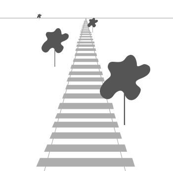

# MVP变换

初始阶段，我们在Local Space中，我们为了能够让屏幕显示3D的效果，需要进行MVP变换。

迄今为止，我们渲染2D图形，我们现在准备利用MVP变换，让我们的屏幕能显示3D世界。

首先是Model Matrix，将本地的空间中的物体渲染到World Space世界空间中，这个世界空间是所有物体所处的位置！（在最初的坐标系中，范围只有$(-1.0,1.0)^3$，通过Model矩阵将范围扩充到$\bold{R}^3$）

然后获取相机的方向信息，得到View Matrix，乘以后就知道以相机为方向的视角了。

接下来是Projection Matrix投影，让物体真正的拥有3D效果，一般使用透视矩阵

经过这三个变换，就成功在Screen Space显示三维物体了。这就是MVP变换，用数学表达式解释：
$$
glPosition=\bold{PVM}·\vec{Position}
$$
将本地的坐标$\vec{Position}$进行矩阵变换，得到屏幕坐标下的坐标$glPosition$

## 齐次坐标表示

在三维坐标系中，我们使用
$$
(x,y,z)
$$
的位置向量表示一个位置信息。

但这其实对于矩阵变换来说特别不方便，主要在于对于坐标的平移操作：
$$
\left[
\begin{array}{cccc}
x' \\
y' \\
z'
\end{array}
\right]
=
\left[
\begin{array}{cccc}
1 & 0 & 0 \\
0 & 1 & 0 \\
0 & 0 & 1 \\
\end{array}
\right]
\left[
\begin{array}{cccc}
x\\
y\\
z
\end{array}
\right]
+
\left[
\begin{array}{cccc}
t_x\\
t_y\\
t_z
\end{array}
\right]
$$
但是这样操作很不好，毕竟有加法，有没有一种矩阵能够一次性平移呢？我们如果将坐标转为齐次坐标：
$$
(x,y,z,1)
$$
那么：
$$
\left[
\begin{array}{cccc}
x'\\
y'\\
z'\\
1
\end{array}
\right]
=
\left[
\begin{array}{cccc}
1 & 0 & 0 & t_x \\
0 & 1 & 0 & t_y\\
0 & 0 & 1 & t_z\\
0 & 0 & 0 & 1
\end{array}
\right]
\left[
\begin{array}{cccc}
x\\
y\\
z\\
1
\end{array}
\right]
$$
我们只用了一个$4\times4$的矩阵实现了平移操作。因此，我们的矩阵操作都是基于齐次坐标！

## 局部空间 Local Space

我们的物体对象最初在局部空间。也就是如果没进行任何变换，那么空间都处于这个位置。一般来讲，坐标都为$(0,0,0)$。所以我们需要将物体摆放到任意位置的时候，就应该进行线性变换了！

## 世界空间 World Space

我们需要将物体摆放到世界中的任意位置，就得让物体的坐标进行模型变换，即物体的坐标乘以矩阵Model Matrix。

Model Matrix的主要工作是将局部空间坐标系转成世界空间坐标系。说白了就是平移坐标，因此Model Matrix的本质就是平移矩阵：
$$
\bold{
M=
\left[
\begin{array}{cccc}
1 & 0 & 0 & t_x \\
0 & 1 & 0 & t_y\\
0 & 0 & 1 & t_z\\
0 & 0 & 0 & 1
\end{array}
\right]
}
$$

于是，这里将局部空间变换成世界空间，只需要：
$$
[\begin{array}{cccc}
x' & y' & z' & 1
\end{array}]^T
=\bold{M}
[\begin{array}{cccc}
x & y & z & 1
\end{array}]^T
$$

## 观察空间 View Space

观察空间也叫摄像机空间，是以图形学中的摄像机模型为视角的一个空间。通常需要一定的位移和旋转变换才能得到。这交给View Matrix解决，通常下会采用LookAt矩阵来代替View Matrix。

View Matrix的主要工作是转换到摄像机的视角。摄像机的视角矩阵我们使用LookAt矩阵实现的，具体推导可以看摄像机及其坐标系的文章，这里只给出矩阵的具体形式：
$$
\bold{LookAt}=
\left[
\begin{array}{cccc}
u_x & u_y & u_z & \bold{-eye}·\bold{u}\\
v_x & v_y & v_z & \bold{-eye}·\bold{v}\\
n_x & n_y & n_z & \bold{-eye}·\bold{n}\\
0 & 0 & 0 & 1
\end{array}
\right]
$$

其中$\bold{u, v, n}$是摄像机坐标系的三个基向量，$\bold{eye}$是摄像机的位置向量。LookAt矩阵的作用是用来处理将观察空间的基向量$\bold{u, v, n}$转换成世界空间的基向量$\bold{x, y, z}$。

## 裁剪空间 Clip Space

通过前面的变换，我们来到了观察空间。但有个问题是，窗口显示不了那么大的区域。因为窗口时有尺寸的。所以我们需要把一些画面给裁剪掉，这就是裁剪空间的由来。裁剪空间的变换，我们需要用到投影矩阵，也就是Projection Matrix。一般投影的方式有两种：正射投影和透视投影。

### 正射投影

顾名思义，其实就是将物体原有的投影原封不动的投影到坐标面：

但这样做会产生不真实的效果。若要采用更真实的效果，应当采用透视投影。

### 透视投影

这就是透视投影，会出现近大远小的情况。我们采用透视投影矩阵完成这样的效果。其实不难做到，我们可以看出来，最终的输出应当为：
$$
\bold{out}=\left[
\begin{array}{c}
x/w\\
y/w\\
z/w
\end{array}
\right]
$$
顶点坐标的每个分量都除以$w$，并且，离观察者越远，$w$应当越大。被变换到裁剪空间的坐标都会在$-w$到$w$的范围内。（但可见区域仍然为$-1$到$1$，因此需要变换到NDC空间）

差不多完成了，最后就变换到NDC空间即可。

