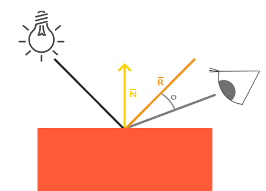

# 冯氏光照简介

冯氏光照是图形学中普遍使用的光照模型，是基本的光照系统。

## 颜色

在物理中我们通常使用三原色模型表示颜色，其基本思想是任何颜色都可以由红蓝绿三种基色来合成，用向量表示：

$$
\bold{RGB}=(R,G,B)
$$

一般来说，$R,G,B\in[0,255]$，不过在OpenGL中我们我们的三基色的取值范围为$(0,1)$。

下面介绍颜色吸收定理：

假设在世界坐标系下存在着一个光源，他发射出颜色为$(1.0,1.0,1.0)$的光，由RGB模型易知这种光的颜色是白色（符合我们的日常生活认知）。

那么我们为什么能看到某些物体的颜色？因为物体吸收了部分颜色，反射出来的颜色被我们看到了。因此，假设世界坐标系存在着另外一个物体，这个物体的本该具有的颜色为珊瑚红$(1.0,0.5,0.31)$。现在我们让光照射在这个物体上，问这个物体最终反射的颜色为什么？答案依然是珊瑚红，这是因为：

$$
\bold{Final\_RGB}=\bold{Light\_RGB}·\bold{Object\_RGB}=(1.0,1.0,1.0)·(1.0,0.5,0.31)\\
=(1.0,0.5,0.31)
$$

这就是颜色吸收定理，物体把光的大部分颜色都吸收了，留下了珊瑚红的颜色反射然后被观察到。

如果我们将光的颜色换成绿色$(0.0,1.0,0.0)$，最终的结果就是：

$$
\bold{Final\_RGB}=\bold{Light\_RGB}·\bold{Object\_RGB}=(0.0,1.0,0.0)·(1.0,0.5,0.31)\\
=(0.0,0.5,0.0)
$$

绿色的光吸收了绝大部分的红色、蓝色，吸收了一部分的绿色，最终也反射了一部分的绿色。所以我们最终看到的颜色是绿色，而不是珊瑚红了。

## 环境光照 ambient

现实生活中，一般在无显光源的情况下，我们都能看到物体。这是因为太阳的光很强，使得月球反射了太阳的光...这种光照一般叫做环境光，它非常弱，抑制于看到的物体是黑色的（比如夜晚在黑暗的地方，你依然可以看到物体，这时候是环境光的原因使得你能看到）


环境光照的实现非常简单，我们只需要给原本的光颜色$\bold{Light\_RGB}$乘以小于1的倍数即可：

```glsl
vec3 ambient = lightColor * ambientStrength
```

## 漫反射 diffuse

漫反射是实现光的基本反射之一。因为在环境光照下，我们虽然能看到物体，但物体非常不清晰，我们甚至看不到它的颜色，这个时候需要漫反射，让我们能看到基本的颜色。


先看这个模型，有个光源，我们为了能看到这个物体（片元），我们需要测量这个光线是以什么样的角度接触到这个片元。并且，如果光线垂直于物体表面，那么这个物体就会最亮。

所以我们可以先计算出这个物体的法向量，然后将光线向量与法线向量点乘，得到的dot product中包含角度的余弦值：

$$
\bold{lightDirection}·\bold{normal}=|\bold{lightDirection}|\ |\bold{normal}| \ \cos\theta
$$

注意这里的所有向量，都是单位向量！

当$\theta$越小的时候，光照越强，这与$\cos$函数的单调性非常相似，所以我们不妨用余弦函数作为光照的参考性。

所以代码这样写：

```glsl
    vec3 norm = normalize(normal);			//获取法向量，记得归一化
    vec3 lightDir = normalize(lightPos - FragPos);  //光线的方向向量，将光源位置向量与片元位置向量相减就可以得到
    float diff = max(dot(norm, lightDir), 0.0);     //点积，获得cos值，因为光强不能有负号，所以用max
    vec3 diffuse = diff * lightColor;
```

注意光线的方向向量：

$$
\bold{lightDirection}=\bold{lightPos}-\bold{FragPos}
$$

在世界坐标系中，我们将光源的位置与片元的位置相减，这样就可以得到光线的方向向量。

## 镜面光照

漫反射只取决于光源，因为这是能分辨出物体的根本属性。而镜面光照取决于人的眼睛。试想一下，人看到镜面反射，是因为光源还是我们眼睛对着物体？答案是后者。所以镜面光照的基本思想我们就知道了:



对于OpenGL来说，人眼就是摄像机。类似于漫反射，我们只要找到翻着后的光线方向向量（出射光方向向量）和摄像机位置，那么就可以计算出他们的点积，通过余弦函数来表示高光的大小。从图片知道，$\theta$越小光照越强。

即首先计算我们视线的方向向量：

$$
\bold{viewDirection}=\bold{viewPos-FragPos}
$$

这样就得到了一个由片元指向摄像机的方向向量。

然后我们需要一个翻折后的光线方向向量，注意原来的$\bold{lightDirection}$是从光源指向片元，我们要用到反方向了（不然cos就是负数了）。然后我们是相对于法向量翻折过去，所以最终：

$$
\bold{reflectDirection}=reflect(-\bold{lightDirection},\bold{normal})
$$

最终我们用$spec$表示高光强度，正如前面所说的，点积：

$$
spec=\max(\bold{viewDirection·reflectDirection}, 0.0)^{32}
$$

32次方是为了尽可能显示大的亮度

```glsl
    //  镜面反射
    float specularStrength = 1.0f;
    vec3 viewDir = normalize(viewPos - FragPos);    //摄像机的观察方向向量，将摄像机位置向量与片元位置向量相减就可以得到
    vec3 reflectDir = reflect(-lightDir, norm);
    float spec = pow(max(dot(viewDir, reflectDir), 0.0), 32);
    vec3 specular = specularStrength * spec * lightColor;
```

## 最终合成

```glsl
    //  合成
    vec3 result = (ambient + diffuse + specular) * objectColor;
    FragColor = vec4(result, 1.0f) ;
```

# 材质

前面的冯氏光照是按照物体为纯颜色时的情况。如果物体的颜色是多样的（即有纹理），我们可以将它的纹理作为漫反射颜色（即漫反射贴图=纹理贴图）。这是因为，我们在漫反射里说到，漫反射使得我们能够看清颜色，说明漫反射某种意义上就是纹理的意思。因此我们可以将漫反射与环境光照合在一起，这样更加适合于有纹理的物体。

为了更好管理变量，我们创建两个结构体变量Material和Light，分别表示纹理与光照。他们都有内建变量：

```

```

我们不再将环境光照与漫反射分开了，因为很多时候两者是可以合在一起的。并且注意到objectColor变成了texture(diffuse, texCoord)。这说明我们的颜色可以用采样器采出的纹理表示。
