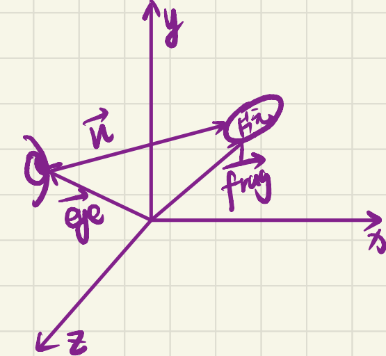
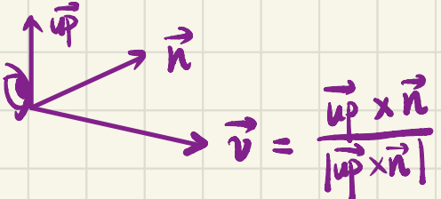
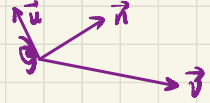

# 摄像机及其坐标系

## 摄像机方向

摄像机是一种抽象的结构，它表示我们看东西的媒介，类似于眼睛。为了定义摄像机，我们给定摄像机的世界空间位置向量$\bold{eye}=(x_0,y_0,z_0,1)$，以及我们要观察的片元的世界空间位置向量$\bold{frag}$。

为了构建摄像机的坐标系，我们需要三个正交的基向量，而其中一个必须表示方向信息。首先可以计算出摄像机的方向向量：

可以计算摄像机的视角方向向量，简称方向向量：
$$
\bold{n=\frac{frag-eye}{|frag-eye|}}
$$

## 摄像机的右轴

现在有了第一个基向量$\bold{n}$，然后需要找到摄像机的右轴，充当其坐标系的第二个基向量。为此，我们要引用一个辅助向量$\bold{up}=(0,1,0)$，也就是上向量。进行叉乘，就可以得到第二个正交的基向量：
$$
\bold{v=\frac{up\times n}{|up\times n|}}
$$

如图所示：

## 摄像机的上轴

最后处理上轴，请问上轴是$\bold{up}$吗？不是！因为$\bold{up}$不一定与$\bold{n}$正交，因此我们还要找到上轴基向量！

非常简单，只需要：
$$
\bold{u=v\times n}
$$
如图所示：

## LookAt矩阵的推导

为了实现世界空间与观察空间的变换，我们需要引入一个矩阵。这就是LookAt矩阵的作用。

LookAt矩阵实现了将摄像机坐标系的基向量变换到世界坐标系的基向量。为此我们将进行推导。我们令：
$$
\bold{LookAt=RT}
$$
其中$\bold{T}$是平移矩阵，$\bold{R}$是旋转矩阵。这个矩阵将进行摄像机坐标系基向量变换到世界坐标系基向量。

首先需要将摄像机平移到世界坐标原点，也就是将$\bold{eye}$向量平移到原点位置，不难知道平移矩阵的值：
$$
\bold{T=
\left[
\begin{array}{cccc}
1&0&0&-x_0\\
0&1&0&-y_0\\
0&0&1&-z_0\\
0&0&0&1
\end{array}
\right]
}
$$
因此：
$$
\bold{T·eye}
=
\left[
\begin{array}{cccc}
1&0&0&-x_0\\
0&1&0&-y_0\\
0&0&1&-z_0\\
0&0&0&1
\end{array}
\right]
\left[
\begin{array}{cccc}
x_0\\
y_0\\
z_0\\
1
\end{array}
\right]
=\bold{0}
$$
平移到了原点。

接下来推导$\bold{R}$，$\bold{R}$是将摄像机坐标系的基向量旋转到世界坐标系的基向量的位置，即：
$$
\left[
\begin{array}{cccc}
\bold{x}&\bold{y}&\bold{z}&\bold{\alpha}
\end{array}
\right]
=\bold{R}
\left[
\begin{array}{cccc}
\bold{u}&\bold{v}&\bold{n}&\bold{\alpha}
\end{array}
\right]
$$
其中$\bold{\alpha=}\left[
\begin{array}{cccc}
0&0&0&1
\end{array}
\right]^T$。

但这样比较难计算，我们可以求$\bold{R^{-1}}$然后求逆矩阵就好了！也就是将世界坐标系的基向量变换到摄像机坐标系的基向量：
$$
\begin{aligned}
\bold{R^{-1}}&=
\bold{
\left[
\begin{array}{cccc}
\bold{u}&\bold{v}&\bold{n}&\bold{\alpha}
\end{array}
\right]
}
\left[
\begin{array}{cccc}
\bold{x}&\bold{y}&\bold{z}&\bold{\alpha}
\end{array}
\right]^{-1}\\
&=\left[
\begin{array}{cccc}
u_x&v_x&n_x&0\\
u_y&v_y&n_y&0\\
u_z&v_z&n_z&0\\
0&0&0&1
\end{array}
\right]
\left[
\begin{array}{cccc}
1&0&0&0\\
0&1&0&0\\
0&0&1&0\\
0&0&0&1
\end{array}
\right]^{-1}\\
&=
\left[
\begin{array}{cccc}
u_x&v_x&n_x&0\\
u_y&v_y&n_y&0\\
u_z&v_z&n_z&0\\
0&0&0&1
\end{array}
\right]
\end{aligned}
$$
根据格拉姆-施密特正交化的理念，能够知道$\bold{R^{-1}}$是正交矩阵，转置矩阵等于逆矩阵，因此：
$$
\bold{R}=\bold{(R^{-1})^{-1}}=\bold{(R^{-1})^T}
=
\left[
\begin{array}{cccc}
u_x & u_y & u_z & 0\\
v_x & v_y & v_z & 0\\
n_x & n_y & n_z & 0\\
0 & 0 & 0 & 1
\end{array}
\right]
$$
综上所述：
$$
\begin{aligned}
\bold{
LookAt=RT
}
&=
\bold{
\left[
\begin{array}{cccc}
u_x & u_y & u_z & 0\\
v_x & v_y & v_z & 0\\
n_x & n_y & n_z & 0\\
0 & 0 & 0 & 1
\end{array}
\right]
\left[
\begin{array}{cccc}
1&0&0&-x_0\\
0&1&0&-y_0\\
0&0&1&-z_0\\
0&0&0&1
\end{array}
\right]
}\\
&=
\bold{
\left[
\begin{array}{cccc}
u_x & u_y & u_z & -x_0u_x-y_0u_y-z_0u_z\\
v_x & v_y & v_z & -x_0v_x-y_0v_y-z_0v_z\\
n_x & n_y & n_z & -x_0n_x-y_0n_y-z_0n_z\\
0 & 0 & 0 & 1
\end{array}
\right]
}\\
&=
\bold{
\left[
\begin{array}{cccc}
u_x & u_y & u_z & \bold{-eye}·\bold{u}\\
v_x & v_y & v_z & \bold{-eye}·\bold{v}\\
n_x & n_y & n_z & \bold{-eye}·\bold{n}\\
0 & 0 & 0 & 1
\end{array}
\right]
}
\end{aligned}
$$
